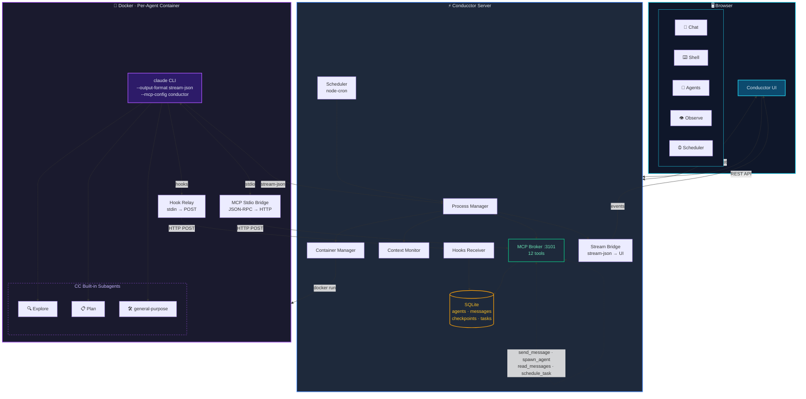

<div align="center">
  <h1>Conducctor</h1>
  <p>Multi-agent orchestration platform for <a href="https://docs.anthropic.com/en/docs/claude-code">Claude Code</a> with real-time observability, inter-agent messaging, container isolation, and scheduled tasks.</p>
  <p>Built on <a href="https://github.com/siteboon/claudecodeui">CloudCLI</a></p>
</div>

---

## What is Conducctor?

Conducctor turns Claude Code from a single-session coding assistant into a **multi-agent orchestration platform**. Spawn multiple CC instances, have them communicate via MCP tools, schedule recurring tasks, and watch everything happen in real-time through a unified observability dashboard.

The "cc" in Condu**cc**tor stands for Claude Code.

## Key Features

### Multi-Agent Orchestration
- **Spawn agents** from the UI or let agents spawn sub-agents via MCP
- **Inter-agent messaging** — agents communicate via `send_message` / `read_messages`
- **Shared state blackboard** — `get_shared_state` / `set_shared_state` for coordination
- **Auto-coordination** — sub-agents report results back, spawner auto-triggers follow-up turns

### Real-Time Observability
- **Activity Timeline** — horizontal scrolling lanes with drifting event dots per agent
- **Event Stream** — unified feed of thinking, text, tool calls, and results with filtering
- **Agent Activity Feed** — per-agent collapsible activity log with subagent tree rendering
- **CC Hooks Receiver** — captures PreToolUse, PostToolUse, SubagentStart/Stop, SessionStart/Stop

### Container Isolation
- **Docker by default** — each agent runs in an isolated container (512MB, 1 CPU)
- **Host path mapping** — containers mirror host filesystem paths for correct session tracking
- **Danger toggle** — disable container isolation with prominent warning in Quick Settings

### Scheduling
- **Cron-based scheduler** — create recurring agent tasks with proper `node-cron`
- **MCP tools** — agents can `schedule_task`, `update_scheduled_task`, `run_scheduled_task`, `list_scheduled_tasks`
- **Scheduler UI** — create, enable/disable, run now, view history
- **Configurable timezone** — `SCHEDULER_TIMEZONE` env var

### Context Lifecycle Management
- **Token usage pie** — click to access Compact, Fork, Checkpoint actions
- **Auto-compact** — configurable threshold triggers automatic compaction
- **Fork** — branch a session to explore a different direction
- **Checkpoint/Restore** — snapshot and restore session state

### 12 MCP Tools
Every agent gets access to:

| Tool | Purpose |
|------|---------|
| `send_message` | Message another agent |
| `read_messages` | Check inbox |
| `list_agents` | Discover running agents |
| `get_shared_state` / `set_shared_state` | Shared blackboard |
| `request_review` | Ask another agent to review work |
| `spawn_agent` | Create a sub-agent |
| `schedule_task` | Create a cron task |
| `list_scheduled_tasks` | View all tasks |
| `update_scheduled_task` | Modify a task |
| `run_scheduled_task` | Trigger a task now |
| `delete_scheduled_task` | Remove a task |

## Architecture



## Quick Start

```bash
git clone https://github.com/ethanbarclay/conducctor.git
cd conducctor
npm install
npm run dev          # Express (3001) + Vite (5173)
```

Open **http://localhost:5173** in your browser.

### Production

```bash
npm run build
npm start            # Serves on port 3001
```

### Docker Agent Image

```bash
docker build -t conductor-agent:latest -f docker/Dockerfile.agent .
```

## UI Tabs

| Tab | Icon | Description |
|-----|------|-------------|
| Chat | MessageSquare | Standard CC chat interface |
| Shell | Terminal | xterm.js terminal |
| Files | Folder | File browser |
| Source Control | GitBranch | Git panel |
| Agents | Cpu | Multi-agent dashboard with spawn dialog |
| Observe | Eye | Timeline + event stream + filters |
| Scheduler | Clock | Scheduled tasks CRUD |

## Environment Variables

```bash
SERVER_PORT=3001              # API server port
VITE_PORT=5173                # Dev server port
HOST=0.0.0.0                  # Bind address
CONTEXT_WINDOW=160000         # Token budget
SCHEDULER_TIMEZONE=           # Cron timezone (default: system)
DATABASE_PATH=                # Custom SQLite path
CLAUDE_CLI_PATH=claude        # Custom CLI path
MCP_BROKER_PORT=3101          # MCP broker port
AUTO_COMPACT_THRESHOLD=0.75   # Auto-compact at 75%
```

## Heritage

- **Base UI**: [CloudCLI / claudecodeui](https://github.com/siteboon/claudecodeui) — session management, chat interface, mobile-responsive UI
- **Observability inspiration**: [agents-observe](https://github.com/simple10/agents-observe) — timeline concept and event visualization patterns
- **Origin**: [NanoClaw](https://github.com/dnakov/nanoclaw) — Discord-based multi-agent CC orchestrator that inspired this project
- **Orchestration layer**: Custom-built — process manager, MCP broker, stdio bridge, container manager, context monitor, scheduler, hooks receiver

## License

AGPL-3.0-or-later (inherited from CloudCLI)
